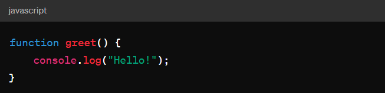
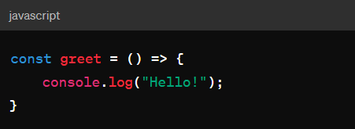

# Functions

## Regular Functions:

Regular functionsa are defined with the function keyword.
They have their own this context, which means this inside a regular function is determined by how the function is called.
Useful for object methods or situations where this might change, like event handlers or constructors.
Example:

## Arrow Functions:
Arrow Functions are written with the => syntax.
They inherit this from the surrounding code, meaning this inside an arrow function refers to the this value from the enclosing lexical context.
Handy for short inline functions, callbacks, or when you want to maintain the current this context without it being changed by the function itself.

So, the main difference is in how they handle this. Regular functions have their own this context, while arrow functions inherit this from their surroundings.
