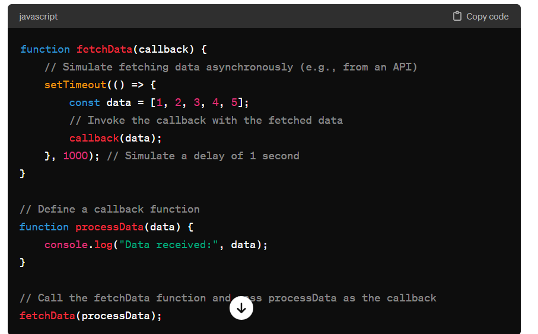

# Callback

Callbacks in JavaScript are functions passed as arguments to other functions to be executed later, typically after an asynchronous operation has completed or when a certain condition is met. Callbacks are a fundamental part of JavaScript's asynchronous programming model, allowing you to perform tasks asynchronously without blocking the execution of other code.

Here's a basic example to illustrate how callbacks work:

In this example:

We have a function fetchData that simulates fetching data asynchronously. It takes a callback function callback as an argument.
After a simulated delay of 1 second (using setTimeout), fetchData invokes the provided callback with the fetched data.
We define a callback function processData that receives the fetched data and logs it to the console.
Finally, we call fetchData and pass processData as the callback function.
Callbacks are widely used in JavaScript for various purposes, including handling responses from APIs, performing asynchronous operations like file I/O or database queries, event handling, and more. They provide a way to execute code in response to certain events or conditions, without blocking the main execution thread.
